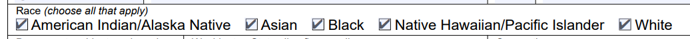
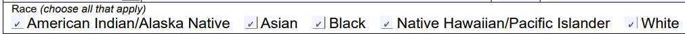

# Using Syncfusion PDF to check a checkbox results in a tiny rendered check

I'm replacing the old `iTextSharp` library in our application with `Syncfusion.Pdf`. 

I have a certain government PDF form I have to fill out electronically. When I fill it with `iTextSharp`, the checkboxes in the [resulting PDF](sample_rendered_pdfs/application_itextsharp_filled.pdf) have the same size as they would if I manually filled out the PDF in the browser:



However, when I fill the same PDF with `Syncfusion.Pdf`, the checks are rendered with a much smaller size:



This government agency has rejected forms in the past as unreadable when they differ too much from the manually filled forms, and I fear that they may do the same here.

**Is there a workaround to prevent `Syncfusion.Pdf` from rendering the checks in a smaller size?**

## To Reproduce

1. Open the solution in Visual Studio
1. Run the application

The application will fill the same PDF template using `iTextSharp` and `Syncfusion.Pdf`, and store the two rendered files in a new folder on your desktop. It will also attempt to open the two PDFs in Chrome.

## Environment

```
Visual Studio 2022 17.1.2
.NET 6.0.201
Syncfusion.Pdf.Net.Core 19.4.0.56
```